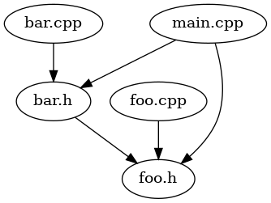
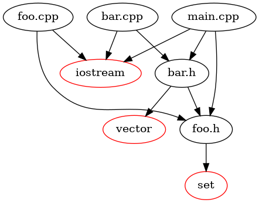

# dep

```
Usage: dep.sh [OPTION]... DIRECTORY
Scan and visualize C/C++ source file dependencies.

Options:
  -e              show extern dependencies
  -h              show help
  -o FILENAME     specify the output png name, default is "dep.png"
```

For an example project, we can get the following output.



If specified with -e option, we will get more dependencies.



Don't use this tool for large project. The generation of picture output is slow. And the readablity is poor.
